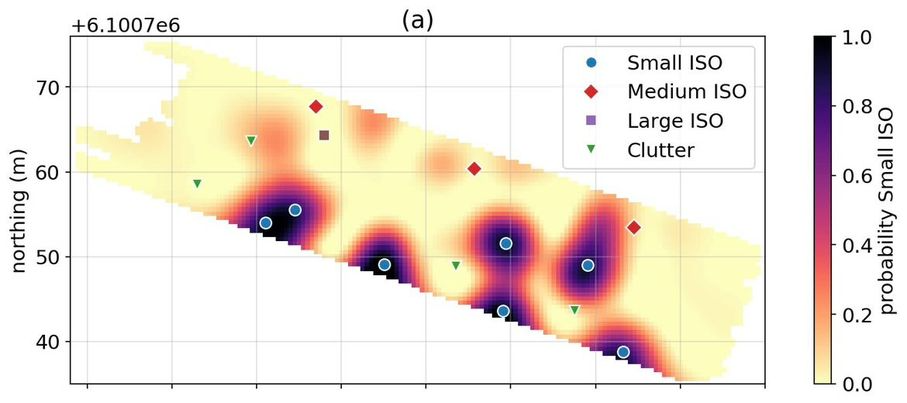

# Machine learning for the classification of unexploded ordnance (UXO) from electromagnetic data

_Lindsey J. Heagy, Douglas W. Oldenburg, Fernando Pérez and Laurens Beran_

https://library.seg.org/doi/10.1190/segam2020-3428369.1

## Summary 

Electromagnetic methods are widely used for the detection and classification of unexploded ordnance objects in former war zones or military training grounds. Typically, targets are classified using intrinsic parameters that are estimated via inversion of the observed data. In this work, we present an approach for using convolutional neural networks to classify unexploded ordnance directly from time-domain electromagnetic data. The outputs of the network are probabilities that the signal in a given spatial window is associated with an ordnance object, as well as a classification, which is simply the class with the largest probability. We demonstrate our approach with a synthetic example and show that the trained neural network can distinguish between small, medium, and large ordnance objects, as well as metallic clutter, and background response. These results illustrate the potential utility of machine learning for the interpretation of electromagnetic data collected over sites contaminated with ordnance.

## Citation 

Lindsey J. Heagy, Douglas W. Oldenburg, Fernando Pérez, and Laurens Beran, (2020), "Machine learning for the classification of unexploded ordnance (UXO) from electromagnetic data," SEG Technical Program Expanded Abstracts: 3482-3486. https://doi.org/10.1190/segam2020-3428369.1
